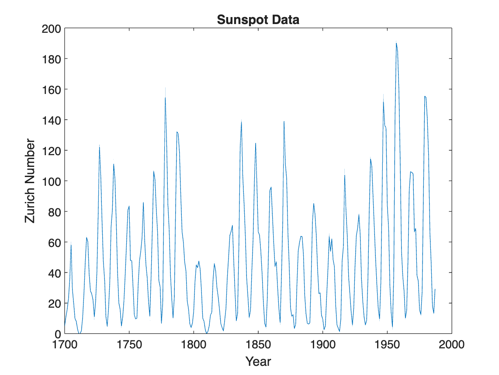
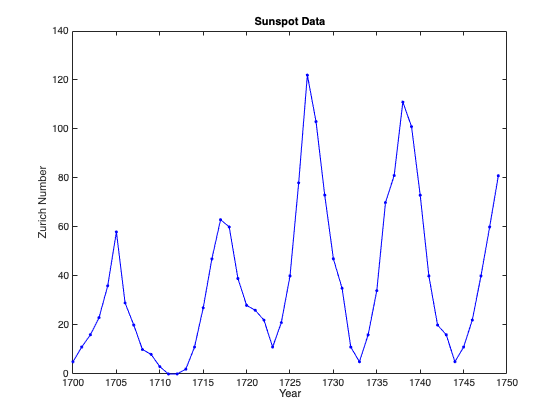
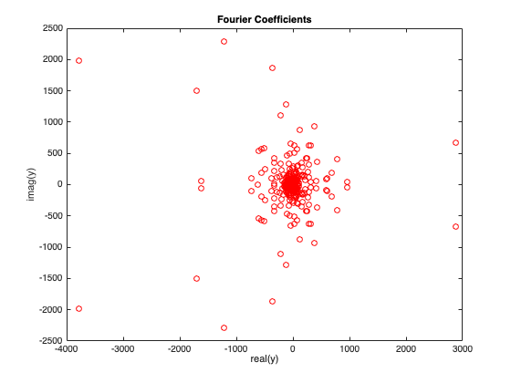
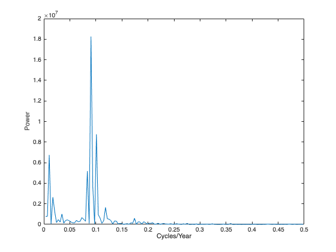
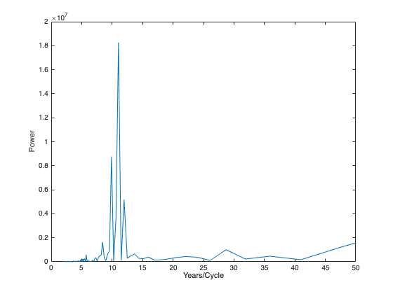

# Analyzing Cyclical Data with FFT
Run this analysis in MATLAB Online [](https://matlab.mathworks.com/open/github/v1?repo=mikecroucher/SunspotDemo&file=/sunspotAnalysis.mlx)

This is an example that was taken from [The MATLAB Documentation](https://uk.mathworks.com/help/matlab/math/using-fft.html).


You can use the Fourier transform to analyze variations in data, such as an event in nature over a period time.


For almost 300 years, astronomers have tabulated the number and size of sunspots using the [Zurich sunspot relative number.](https://en.wikipedia.org/wiki/Sunspot_number)  Plot the Zurich number over approximately the years 1700 to 2000.

```matlab
load "sunspot.dat";
year = sunspot(:,1);
relNums = sunspot(:,2);
plot(year,relNums)
xlabel('Year')
ylabel('Zurich Number')
title('Sunspot Data')
```



To take a closer look at the cyclical nature of sunspot activity, plot the first 50 years of data.

```matlab
plot(year(1:50),relNums(1:50),'b.-');
xlabel('Year')
ylabel('Zurich Number')
title('Sunspot Data')
```



The Fourier transform is a fundamental tool in signal processing that identifies frequency components in data.  Using the `fft` function, take the Fourier transform of the Zurich data.  Remove the first element of the output, which stores the sum of the data.  Plot the remainder of the output, which contains a mirror image of complex Fourier coefficients about the real axis.  

```matlab
y = fft(relNums);
y(1) = [];
plot(y,'ro')
xlabel('real(y)')
ylabel('imag(y)')
title('Fourier Coefficients')
```



Fourier coefficients on their own are difficult to interpret.  A more meaningful measure of the coefficients is their magnitude squared, which is a measure of power.  Since half of the coefficients are repeated in magnitude, you only need to compute the  power on one half of the coefficients.  Plot the power spectrum as a function of frequency, measured in cycles per year. 

```matlab
n = length(y);
power = abs(y(1:floor(n/2))).^2; % power of first half of transform data
maxfreq = 1/2;                   % maximum frequency
freq = (1:n/2)/(n/2)*maxfreq;    % equally spaced frequency grid
plot(freq,power)
xlabel('Cycles/Year')
ylabel('Power')
```



Maximum sunspot activity happens less frequently than once per year.  For a view of the cyclical activity that is easier to interpret, plot power as a function of period, measured in years per cycle.  The plot reveals that sunspot activity peaks about once every 11 years.    

```matlab
period = 1./freq;
plot(period,power);
xlim([0 50]); %zoom in on max power
xlabel('Years/Cycle')
ylabel('Power')
```



*Copyright 1984\-2014 The MathWorks, Inc.*

